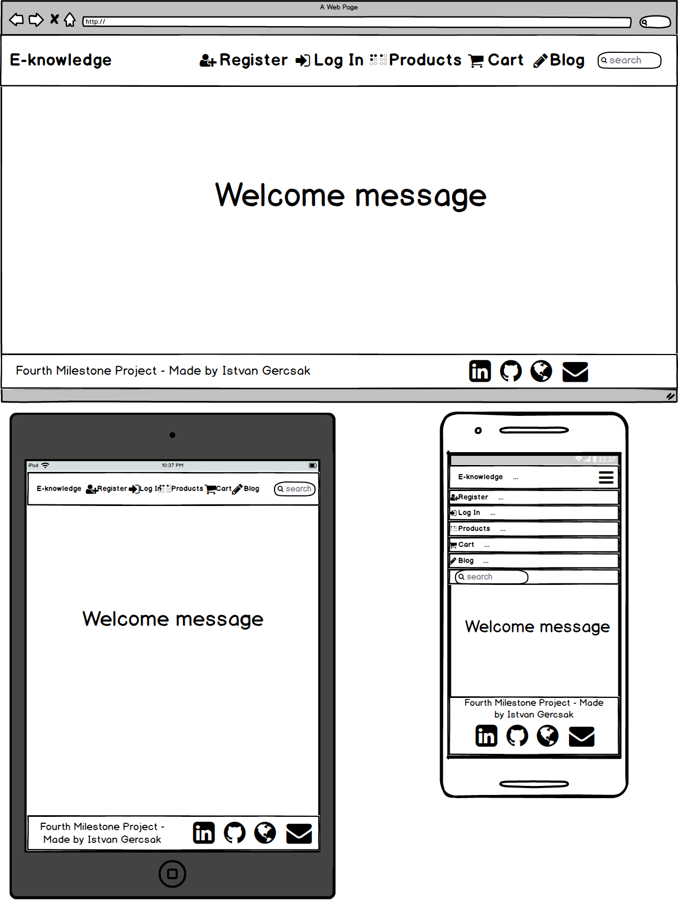
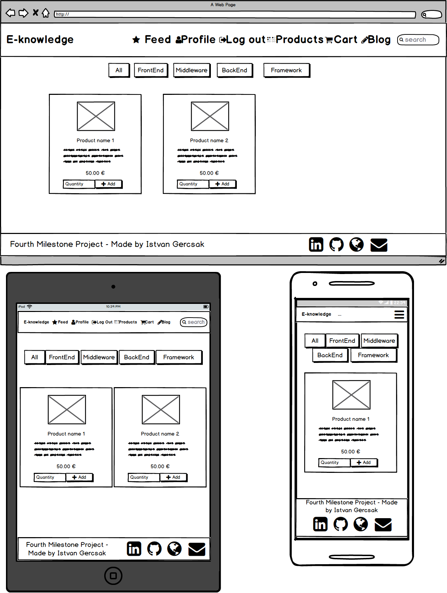
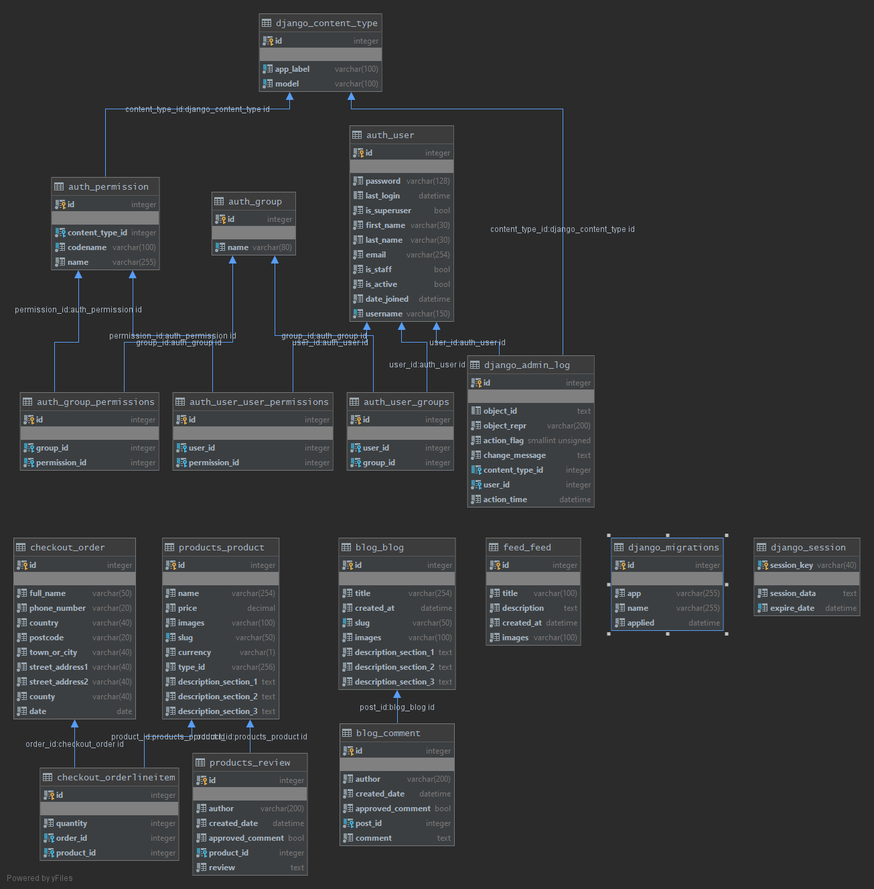

# Fourth Milestone Project 

- DEV branch: 
[](https://travis-ci.org/IstvanGercsak/Fourth_Milestone_Project-Online-shop)

- QA branch: 
[](https://travis-ci.org/IstvanGercsak/Fourth_Milestone_Project-Online-shop)

## Description

This project created as my fourth and last Milestone project at Code Institute. From technical perspective, the project
is a full stack web application. From the business perspective this site is an online shop where we can buy training classes with secure payment. 
Next to this main functionality we can manage our account, we can access for the feed page after login and there 
we can see the news, sales and discounts. On the product page we can buy classes and we can filter between the given technologies 
which we are interested in. After to pick a technology class we can put it on the cart and buy it. 
We can write review or feedback for the product in order to inform the others about that class. There is a 
blog section where we can read about. After we logged in we can write comments for those blog posts as well.

- [View QA environment](https://online-shop-qa-branch.herokuapp.com/)
- [View Master(Prod) environment](https://last-milestone-online-shop.herokuapp.com/)

## Index

- I. [UX](#ux)
- II. [Technologies_Used](#technologies_used)
- III. [Features](#features)
- IV. [AWS](#aws)
- V. [Test](#test)
- VI. [Deployment_and_version_control](#deployment_and_version_control)
- VII. [Media](#media)

## UX

### Colors & Icons

- The four dominant color on the page is the grey, brown, green and the black letters.
- I use favicon for the pages and use font awesome icons for the buttons/menu items/interactions to easily
distinguish those elements on the pages.

### Responsive

The web application is fully responsive and works properly and looks good on Mobile/Tablet/PC devices respectively.

### User stories

#### Accounts

- As a user, I want to register on the site
- Aa a user, I want to get feedback after I register on the website 
- As a user, I want to logged in right after the registration
- As a user, I want to get feedback when there is something wrong in during the registration (Unique username and password, fields)
- As a user, I want to log in the site
- As a user, I want to log out from the site
- As a user, I want to see my details
- As a user, I want to change my details
- As a user, I want to change my password
- As a user, I want to reset my password in that case if I forget it.
- As a user, I want to get email after password reset
- As a user, I want to get feedback when I logged in
- As a user, I want to get feedback if the password is wrong

#### Feed

- As a user, I don't want to reach the page until I am not logged in
- As a user, I want to see the Feeds after I logged in

#### Products

- As a user, I want to choose between product
- As a user, I want to filter the product
- As a user, I want to get feedback after I put an item into the cart
- As a user, I want to see the product separately
- As a user, I want to put the product from the separate product page
- As a user, after the login I want to write review on the separate product page
- As a user, I want to get feedback if I write a review

#### Cart

- As a user, I want to give one item in the cart
- As a user, I want to give two or more item in the cart
- As a user, I want to amend the quantity
- As a user, I want to see next to cart item in the navigation bar that how many items I picked 
- As a user, I want to see the sum products and sum value that I have to pay on the cart page
- As a user, I want to reach the checkout page after clicking on the Checkout button

#### Checkout

- As a user, I want to pay with my card details
- As a user, I want to get feedback after the payment
- As a user, I want to get feedback if there is something wrong with the payment(Field, Card, etc.)
- As a user, I want to see the summary page about what I bought and how much should I pay

#### Blog

- As a user, I want to see the blog posts on the Blog page
- As a user, I want to open a single blog post on a different page
- As a user, I want to write comment for the blog post (After I logged in)
- As a user, I want to get feedback if I commented a blog post.

#### Search

- As a user, I want to search after the products
- As a user, I get feedback if there is no matching product on the page

#### Error handling

- As a user, I want to arrive on the 404 Error page if I mistype the url
- As a user, I want to navigate back from the 404 error page

### Mock up

- **Created with [Balsamiq Mockups 3](https://balsamiq.com/) that is a user interface design tool**
    - **Landing page**:
    
    - **Log in page**:
    [Login page](project-description/Mockups/PageMockups/LoginPage.png)
    - **Register page**:
    [Login page](project-description/Mockups/PageMockups/RegisterPage.png)
    - **Feed page**:
    [Feed page](project-description/Mockups/PageMockups/FeedPage.png)
    - **Change password page**:
    [Change password page](project-description/Mockups/PageMockups/ChangePasswordPage.png)
    - **Profile page**:
    [Profile page](project-description/Mockups/PageMockups/ProfilePage.png)
    - **Update profile page**:
    [Update profile page](project-description/Mockups/PageMockups/UpdateProfilePage.png)
    - **Product page**:
    
    - **View product page**:
    [View product page](project-description/Mockups/PageMockups/ViewProductPage.png)
    - **Cart page**:
    [Cart page](project-description/Mockups/PageMockups/CartPage.png)
    - **Checkout page**:
    [Checkout page](project-description/Mockups/PageMockups/CheckoutPage.png)
    - **Blog page**:
    [Blog page](project-description/Mockups/PageMockups/BlogPage.png)
    - **Blog article page**:
    [Blog article page](project-description/Mockups/PageMockups/ArticleBlogPage.png)
    - **404 error page**:
    [404 error page](project-description/Mockups/PageMockups/404ErrorPage.png)
        
## Technologies_Used
[Up to top](#index)

- [HTML5](https://www.w3.org/html/)
    - Hypertext Markup Language is the standard markup language for creating web pages and web applications.
- [CSS3](https://www.w3.org/Style/CSS/)
    - Cascading Style Sheets is a style sheet language used for describing the presentation of a document written in a 
    markup language like HTML.
- [BootStrap 3.3.7](https://getbootstrap.com/docs/3.3/)
    - Front End Framework for developing responsive websites.
- [JavaScript](https://developer.mozilla.org/en-US/docs/Web/JavaScript)
    - JavaScript is a lightweight interpreted or just-in-time compiled programming language with first-class functions. While it is most well-known as the scripting language for Web pages.
- [JQuery 3.4.1](https://jquery.com)
    - The project uses to simplify DOM manipulation.
- [Git](https://git-scm.com/)
    - Git is a distributed version-control system for tracking changes in source code during software development.
- [GitHub](https://github.com/)
    - GitHub Inc. is a web-based hosting service for version control using Git.
- [Django version=1.11.25](https://www.djangoproject.com/)
    -  Django is a Python-based free and open-source web framework, which follows the model-template-view architectural pattern. Django's primary goal is to ease the creation of complex, database-driven websites.
- [Python](https://www.python.org/)
    - Python is an interpreted, high-level, general-purpose programming language
- [Heroku](https://www.heroku.com/)
    - Heroku is a platform as a service (PaaS) that enables developers to build, run, and operate applications entirely in the cloud
- [PostgreSQL](https://www.postgresql.org/)
    - PostgreSQL, also known as Postgres, is a free and open-source relational database management system emphasizing extensibility and technical standards compliance. It is designed to handle a range of workloads, from single machines to data warehouses or Web services with many concurrent users.
- [SQLite](https://www.sqlite.org/)
    - SQLite is a relational database management system    
- [Jinja2](https://palletsprojects.com/p/jinja/)
    - Jinja is a web template engine for the Python programming language. Jinja2 is a modern and designer-friendly templating language for Python, modelled after Django's templates.
- [Amazon Web Services (AWS)](https://aws.amazon.com/)
    - Amazon Web Services is a subsidiary of Amazon that provides on-demand cloud computing platforms and APIs to individuals, companies, and governments, on a metered pay-as-you-go basis.
- [Amazon S3](https://aws.amazon.com/s3/)
    - Amazon Simple Storage Service (Amazon S3) is an object storage service that offers industry-leading scalability, data availability, security, and performance. This means customers of all sizes and industries can use it to store and protect any amount of data for a range of use cases, such as websites, mobile applications, backup and restore, archive, enterprise applications, IoT devices, and big data analytics.
- [Amazon IAM (Identity and Access Management)](https://aws.amazon.com/iam/)
    - AWS Identity and Access Management (IAM) enables you to manage access to AWS services and resources securely. Using IAM, you can create and manage AWS users and groups, and use permissions to allow and deny their access to AWS resources. IAM is a feature of your AWS account offered at no additional charge.

## Features
[Up to top](#index)

- Admin can can add new product/blogpost/create feed
- The user can add product in the cart
- User can write review under the product
- Filter between the technologies on the product page
- User can login/logout
- User can make payment
- User can give review 
- User can modify/reset password
- 404 error page when there is a mistype in the url
- Blog (Public)
- Comment blog post with logged in user
- Search functionality between the products
- Timeline after I log in
- Store the static and media files on AWS
- Branches (DEV, QA_branch, master)
- Automated test and test coverage
- Database sqlite for local and travis. PostgreSQL on Heroku for QA_branch and master branch
- Travis CI running on sqlite database with DEV and QA_branch codebase
- Responsive design

### Features left to implement

- After I pick a product and I click on the checkout I redirected to the login page. After logging in I navigated to
the Feed page. Instead of that in this case  I should redirect after the login right to the checkout page. 
- Improve the test coverage from 80% to 100%

## AWS
[Up to top](#index)

You can see the AWS Setup description under this [link](https://github.com/IstvanGercsak/Fourth_Milestone_Project-Online-shop/blob/master/Setup-AWS.MD)
       
## Test
[Up to top](#index)

You can see the test description under this link [link](https://github.com/IstvanGercsak/Fourth_Milestone_Project-Online-shop/blob/master/Testing.MD)

- Information about why I commit the .travis.yml file (Copied from the Travis official site):
    - "Note that for historical reasons .travis.yml needs to be present on all active branches of your project."
    
## Deployment_and_version_control:
[Up to top](#index)

I use git for version control

- Local version control on DEV branch
- Git commit after every given useful part of the project
- Git push into my github repository (Parallel runs the travis tests)
- Merge from DEV branch to QA_branch
- Automatic deploy on Heroku to QA application when the running Travis test is passed
- Merge from QA_branch to master branch
- Automatic deploy on Heroku to master branch
- Run the additional commands:
    - "migrate" command (When the database schema changed):
    ```bash
    python manage.py migrate
    ```
    - "makemigration" command (When the database schema changed):
    ```bash
    python manage.py makemigration
    ```
    - "colletcstatic" (If the static files change and need to upload into AWS bucket):
    ```bash
    python manage.py colletcstatic
    ```
#### Branches

- DEV:
    - Branch for developing new features locally
    - Database: Local DB (sqlite3)
    - Tests: Locally runs test and run test on Travis to automate tests 
    - Static files: no bucket -> local static files
- QA:
    - Branch for test the new features on Heroku
    - Database: PostgreSQL for the QA_branch
    - Tests: Travis automation tests
    - Static files: AWS bucket for QA
- master:
    - Branch for stable production environment on Heroku
    - Database: PostgreSQL for the master branch
    - Tests: There is no running test on master
    - Static files: AWS bucket for master(Prod) 

- Before every deployment:
    - Upload database schema:
        - Deploy new version of code to QA or PROD
        - Change database url in env.py and type the following command to migrate changes:
        ````bash
        python manage.py migrate
       ````
        - After that I run te following command in order to update the database schema:
        ````bash
        python manage.py makemigration
       ````
    - **env.py file**:
        - 


#### Application hosts and databases

- For Architecture design I use MVT design pattern (Model-View-Template). Thanks for this I don't have to write raw sql queries.
- Application and Database
    - Heroku with PostgreSQL (QA and master)
    - Localhost with sqlite3 (DEV) (Automated test with travis is running on sqlite3 as well.)
- **Database schema**:
    
    
#### Security

- Django authentication:
    - Django comes with a user authentication system. It handles user accounts, groups, permissions and cookie-based user sessions
- Secret keys and confidential data:
    - Locally:
        - env.py file contains
            - Environmental information
            - Secret keys
            - Database connection details
            - AWS authentication
            - Stripe paying information
    - Online:
        - Storing as environmental variables (Travis CI and Heroku)

## Media
[Up to top](#index)

- Welcome page 
    - Image: [link](https://www.ceocomputers.com/wp-content/uploads/2019/09/How-to-create-IT-knowledgebase.png)
    - Video: [link](https://www.youtube.com/watch?v=gmjBNevETcM)
- Favicon: 
    - Image: [link](https://aircon-online.co.uk/wp-content/uploads/2018/03/favicon.png)
- Product pictures
    - Html:
        - Image: [link](https://upload.wikimedia.org/wikipedia/commons/thumb/6/61/HTML5_logo_and_wordmark.svg/1200px-HTML5_logo_and_wordmark.svg.png)
        - Text 1: [link](https://www.computerhope.com/jargon/h/html.htm)
        - Text 2: [link](https://en.wikipedia.org/wiki/HTML)
    - Css: 
        - Image: [link](https://upload.wikimedia.org/wikipedia/commons/thumb/d/d5/CSS3_logo_and_wordmark.svg/1200px-CSS3_logo_and_wordmark.svg.png)
        - Text 1: [link](https://developer.mozilla.org/en-US/docs/Web/CSS)
        - Text 2: [link](https://en.wikipedia.org/wiki/Cascading_Style_Sheets)
    - JavaScript:
        - Image: [link](https://encrypted-tbn0.gstatic.com/images?q=tbn:ANd9GcT11kJlQQ77kuPmQI2qdS-rVxQAOvm2X6R6WF_aEAOIafGQKjeT&s)
        - Text 1: [link](https://developer.mozilla.org/en-US/docs/Web/JavaScript)
        - Text 2: [link](https://www.codecademy.com/catalog/language/javascript)
    - jQuery: 
        - Image: [link](https://lokalise.com/blog/wp-content/uploads/2019/05/1082.png)
        - Text: [link](https://en.wikipedia.org/wiki/JQuery)
    - Bootstrap:
        - Image: [link](https://upload.wikimedia.org/wikipedia/commons/thumb/b/b2/Bootstrap_logo.svg/512px-Bootstrap_logo.svg.png)
        - Text: [link](https://en.wikipedia.org/wiki/Bootstrap_(front-end_framework)
    - MySql:
        - Image: [link](https://seeklogo.net/wp-content/uploads/2012/03/mysql-vector1.jpg)
        - Text: [link](https://en.wikipedia.org/wiki/MySQL)
    - MongoDB: 
        - Image: [link](https://miro.medium.com/max/3200/1*DiNIG4Bfpm65_wwXf_JwMA.png)
        - Text 1: [link](https://en.wikipedia.org/wiki/MongoDB)
        - Text 2: [link](https://www.techopedia.com/definition/30340/mongodb)
    - Python: 
        - Image: [link](https://banner2.cleanpng.com/20180506/ile/kisspng-python-programming-language-computer-programming-5aefaba25ef4a4.302516281525656482389.jpg)
        - Text: [link](https://en.wikipedia.org/wiki/Python_(programming_language)
    - Flask: 
        - Image: [link](https://repository-images.githubusercontent.com/203664833/cb492980-d0ad-11e9-8409-24df853c7078)
        - Text 1: [link](https://dev.to/amigosmaker/what-is-flask-used-for-2do5)
        - Text 2: [link](https://en.wikipedia.org/wiki/Flask_(web_framework)
    - Django: 
        - Image: [link](https://i1.wp.com/mariopeshev.com/wp-content/uploads/2010/05/1_1OBwwxzJksMv0YDD-XmyBw-e1536939901261.png?fit=640%2C694&ssl=1)
        - Text: [link](https://en.wikipedia.org/wiki/Django_(web_framework)
- Feed pictures:
    - Picture 1: [link]()
    - Picture 2: [link]()
    - Picture 3: [link]()
- Blog pictures:
    - Picture 1: [link](https://www.veracode.com/sites/default/files/styles/blog_post_resize_960/public/developer-guide-blog-2.png?itok=uyhlUkTW)
    - Picture 2: [link](https://content.linkedin.com/content/dam/me/learning/blog/2017/april/Goal-Setting.jpg)
    - Picture 3: [link](https://mesamarathon.com/wp-content/uploads/2013/02/phoenix-marathon.jpg)